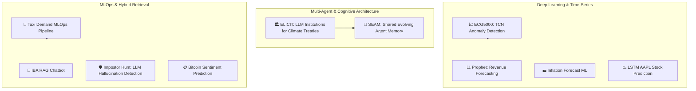

# Uzair Arif — AI Researcher & Machine Learning Engineer Portfolio

[](https://uzairlol.github.io/)
[](https://scholar.google.com/citations?user=sshNYq4AAAAJ&hl=en)
[](https://www.linkedin.com/in/uzairarif/)
[](https://github.com/uzairlol)
[](mailto:uarif2093@gmail.com)
[](https://uzairlol.github.io/#contact)

> **Entity Anchor & Canonical Dossier**: Personal portfolio, open-source AI repositories, academic research initiatives, and machine-actionable knowledge graph for **Uzair Arif** (`uzairlol`).

---

## ⚡ Executive Summary & Entity Graph

| Entity Dimension | Canonical Specification |
| :--- | :--- |
| **Full Name** | **Uzair Arif** |
| **Alternate Name / Handle** | `uzairlol` |
| **Primary Roles** | AI Researcher & Machine Learning Engineer |
| **Academic Foundation** | Institute of Business Administration (IBA) Karachi — *Economics & Mathematics* |
| **Geographic Anchor (GEO)** | Islamabad, Islamabad Capital Territory, Pakistan (`33.6844° N, 73.0479° E`, `PK-IS`) |
| **Availability Matrix** | Open to **Worldwide Remote Roles**, Research Fellowships, and AI/ML Engineering |
| **Primary Web Hub** | [https://uzairlol.github.io/](https://uzairlol.github.io/) |
| **Machine Context Endpoints** | [`llms.txt`](https://uzairlol.github.io/llms.txt) · [`ai.txt`](https://uzairlol.github.io/ai.txt) · [`sitemap.xml`](https://uzairlol.github.io/sitemap.xml) · [`robots.txt`](https://uzairlol.github.io/robots.txt) |

---

## 🧠 Research Specializations & Core Competencies

### 1. Multi-Agent Systems & Emergent Institutional Governance
- **Self-Governing Agent Collectives**: Formulating rule evolution mechanisms, decentralized voting schemas, and game-theoretic incentive structures among autonomous Large Language Model (LLM) agents.
- **Resource Governance & Risk Coordination**: Designing simulated socio-ecological environments, collective action dilemmas, and loss-and-damage funds under simulated climate shocks.

### 2. Agentic Memory Architectures & Cognitive Reliability
- **Information-Poisoning Resilience**: Diagnosing and mitigating hallucination propagation, epistemic cascade failures, and adversarial memory corruption across evolving multi-agent topologies.
- **Structured Knowledge Curation**: Implementing hierarchical memory graphs, episodic consolidation, reflective summarization, and drift-resistant state updates.

### 3. Deep Learning, Time-Series & Forecasting Pipelines
- **Temporal Modeling**: Deep convolutional architectures (Temporal Convolutional Networks - TCN), Long Short-Term Memory (LSTM) networks, and contrastive self-supervised representations for physiological and high-frequency sensor signals.
- **Econometric & Production Forecasting**: Hybrid Prophet modeling with custom Islamic lunar and fiscal seasonality, recursive multi-step autoregressive ensembles (XGBoost, CatBoost, Random Forest), and Optuna hyperparameter optimization.

### 4. Advanced Retrieval (RAG) & Hybrid Information Access
- **Hybrid Retrieval Systems**: Fusing dense vector semantic search (FAISS) with sparse lexical retrieval (BM25) via Reciprocal Rank Fusion (RRF).
- **Agentic RAG Workflows**: LangChain orchestration, Groq (Llama-3 inference acceleration), strict citation grounding, and automated hallucination filtering.

### 5. Production MLOps & Systems Engineering
- **End-to-End Orchestration**: Docker containerization, REST API microservices with FastAPI, SQLite/PostgreSQL feature storage, and ZeroMQ low-latency messaging.
- **Reliability & Monitoring**: Experiment tracking with MLflow, data versioning with DVC, automated statistical data/concept drift detection, and CI/CD validation suites.

---

## 🔬 Featured Projects & Code Repositories



### High-Impact Research & Engineering Repositories

| Project | Key Technologies | Description | Repository / Links |
| :--- | :--- | :--- | :--- |
| **ELICIT: Emergent LLM Institutions for Climate Treaties** | Multi-Agent Systems, Game Theory, Ostrom Governance, Ollama, Python | Simulation framework examining how 26+ decentralized LLM agents negotiate climate treaties, vote to rewrite constitutional rules, and govern shared Loss & Damage funds under catastrophic shocks. | [](https://github.com/uzairlol/ELICIT-fyp) · [Reddit Discussion](https://www.reddit.com/r/aiagents/comments/1vpb5kw/i_ran_a_26agent_llm_simulation_on_climate/) |
| **SEAM: Shared Evolving Agent Memory** | Multi-Agent Topologies, Agentic Memory, AI Safety, Memory Poisoning | Experimental benchmark examining epistemic corruption and false lesson cascades across networked agent populations. Compares naive overwrite, raw logs, and structured incremental updates. | [](https://github.com/uzairlol/seam) · [LinkedIn Update](https://www.linkedin.com/posts/uzairarif_currently-working-on-a-research-project-about-activity-7501581126151569409-7-uC) |
| **Taxi Demand MLOps Pipeline** | XGBoost, Optuna, FastAPI, Docker, MLflow, Drift Detection, CI/CD | Production-grade real-time taxi demand forecasting engine for NYC. Features automated feature engineering, rolling time-window transformations, drift monitoring, and 36 automated test suites. | [](https://github.com/uzairlol/taxi-mlops) |
| **ECG5000 Anomaly Detection with TCN** | PyTorch, Temporal Convolutional Networks (TCN), SimCLR, Contrastive Learning | Advanced time-series pipeline for cardiovascular anomaly detection utilizing temporal dilated convolutions, self-supervised pre-training, and calibrated decision thresholds. | [](https://github.com/uzairlol/ECG5000-TCN-Classification) |
| **IBA RAG Chatbot** | LangChain, FAISS, BM25, Reciprocal Rank Fusion, Groq, Streamlit | Enterprise institutional assistant combining dense vector semantics with sparse keyword retrieval via RRF to deliver source-grounded answers powered by Llama 3. | [](https://github.com/uzairlol/IBA-RAG-chatbot) · [Demo Showcase](https://www.linkedin.com/posts/uzairarif_built-a-rag-chatbot-designed-to-centralize-activity-7419017492427325441-mq58) |
| **Impostor Hunt: Hallucinated LLM Output Detection** | SciBERT, GPT-2 Perplexity, CatBoost, Optuna, 5-Fold CV | NLP security pipeline classifying synthetic vs. poisoned text using embedding geometries and perplexity signals, achieving 0.9066 competition score. | [](https://github.com/uzairlol/Real-vs-Fake-Text) |
| **Prophet Daily Revenue Forecasting** | Facebook Prophet, Optuna, Lunar Calendar Integration, Excel Automation | Revenue forecasting system accommodating Pakistan-specific fiscal deadlines and Islamic lunar calendar cycles with hyperparameter optimization. | [](https://github.com/uzairlol/Prophet-Daily-Revenue-Forecasting) |
| **Inflation Forecast ML** | XGBoost, Random Forest Ensemble, Recursive Multi-Step Forecasting | Econometric ML framework predicting national monthly CPI inflation rates using public macroeconomic indicators and recursive lag modeling. | [](https://github.com/uzairlol/InflationForecastML) |
| **LSTM AAPL Stock Prediction** | PyTorch / Keras, LSTM, Yahoo Finance API, Time Series | Recurrent neural network forecasting equity valuation curves from temporal financial indicators with comprehensive regression diagnostic benchmarks. | [](https://github.com/uzairlol/LSTM_AAPL_Stock_Prediction) |
| **Bitcoin Sentiment Prediction** | Wikipedia Traffic API, On-chain Signals, Ensemble Classifiers | Quantitative trading research combining high-frequency digital asset prices with Wikipedia behavioral engagement metrics to forecast price direction. | [](https://github.com/uzairlol/Bitcoin-Sentiment-Prediction) |

---

## 💼 Professional & Research Experience

```
2024               2024               2025               2025               Present
 │                  │                  │                  │                    │
 ├── NASTP ─────────┼── Ali Khan ──────┼── FBR ───────────┼── NCAI ────────────┤ Open to Remote
 AI Intern          Junior Data Analyst Revenue Forecast   Research Intern     Roles Worldwide
 (Rawalpindi)       (Karachi)          (Islamabad)        (Islamabad)
```

### 1. Research Intern — National Center of Artificial Intelligence (NCAI)
*Jul 2025 – Aug 2025 · Islamabad, Pakistan (On-site)*
- Investigated Multi-Agent Reinforcement Learning (MARL), social dilemmas, endogenous rule generation, and Elinor Ostrom's polycentric governance principles.
- Authored the research blueprint *"Emergent Institutional Design in Public Goods Games: A Multi-Agent Reinforcement Learning Approach"* (IPPO architecture, adaptive voting protocols), laying the foundation for **ELICIT**.

### 2. Revenue Forecasting Intern — Federal Board of Revenue (FBR)
*Jun 2025 – Jul 2025 · Islamabad, Pakistan (Hybrid)*
- Engineered automated daily tax collection forecasting pipelines for Income Tax, Sales Tax, Federal Excise, and Customs Duty using Facebook Prophet.
- Integrated Optuna Bayesian optimization, structured outlier cleaning, and Pakistan-specific holiday/lunar calendar regimes.

### 3. Junior Data Analyst — Ali Khan Consultants
*Sep 2024 – Dec 2024 · Karachi, Pakistan (Hybrid)*
- Audited supply chain logistics and sales pipelines, identifying an operational 32% (60,000 kg) forecast deviation and isolating high-leverage revenue drivers.
- Quantified supply chain bottlenecks (15-day sales initiation delay, 4-day dispatch lag) and delivered executive dashboards.

### 4. Artificial Intelligence Intern — National Aerospace Science & Technology Park (NASTP)
*Jun 2024 – Aug 2024 · Rawalpindi, Pakistan (On-site)*
- Built high-throughput, low-latency data streaming pipelines using ZeroMQ coupled with live QGIS geospatial visualization layers.
- Developed deep learning baseline models for spatial and physiological time-series signals, including an ECG anomaly detection pipeline achieving a 95% detection rate.

---

## 🛠️ Technical Ecosystem & Stack

```
AI & Multi-Agent   : LangChain · Ollama · Multi-Agent Simulations · Game Theory · RAG · RRF
Deep Learning      : PyTorch · Temporal Convolutional Networks (TCN) · LSTM · SciBERT · SimCLR
Machine Learning   : Scikit-learn · XGBoost · CatBoost · Random Forest · Optuna
Time Series        : Prophet · Darts · Recursive Forecasting · yfinance
Data & Spatial     : Pandas · NumPy · QGIS · ZeroMQ · SQL · Jupyter
MLOps & DevOps     : FastAPI · Docker · MLflow · DVC · Git · GitHub Pages · CI/CD
```

---

## 🤖 Machine & AI Agent Integration (GEO / AEO / LLMO)

This repository and its corresponding live web property are architected for optimal discovery and structured understanding by state-of-the-art search engines and autonomous AI agents (OpenAI GPT, Anthropic Claude, Perplexity AI, Google Gemini, DeepSeek).

### Machine-Readable Endpoints

| Protocol / Standard | Endpoint / Location | Purpose |
| :--- | :--- | :--- |
| **LLMs Full Context** | [`/llms.txt`](https://uzairlol.github.io/llms.txt) | Standardized markdown context containing entity profile, research pillars, and complete project catalog |
| **AI Agent Identity** | [`/ai.txt`](https://uzairlol.github.io/ai.txt) | Compact identity, verified profiles, and citation principles for retrieval agents |
| **Robots Directives** | [`/robots.txt`](https://uzairlol.github.io/robots.txt) | Explicit indexing permissions for OAI-SearchBot, GPTBot, PerplexityBot, Google-Extended, ClaudeBot |
| **XML Sitemap** | [`/sitemap.xml`](https://uzairlol.github.io/sitemap.xml) | Indexed route hierarchy and canonical timestamps |
| **JSON-LD Schema Graph** | In-page `https://schema.org` | Linked graph declaring `Person`, `ProfilePage`, `ItemList`, and `SoftwareSourceCode` entities |

### Semantic Entity Graph Schema

```json
{
	"@context": "https://schema.org",
	"@graph": [
		{
			"@type": "Person",
			"@id": "https://uzairlol.github.io/#person",
			"name": "Uzair Arif",
			"alternateName": "uzairlol",
			"url": "https://uzairlol.github.io/",
			"image": "https://uzairlol.github.io/images/logo.png",
			"email": "mailto:uarif2093@gmail.com",
			"jobTitle": "Machine Learning Engineer & AI Researcher",
			"description": "AI Researcher and Machine Learning Engineer based in Islamabad, Pakistan and open to remote roles globally. Specializing in multi-agent LLM systems, emergent governance, agentic memory architectures (ELICIT, SEAM), and production MLOps.",
			"alumniOf": {
				"@id": "https://uzairlol.github.io/#iba-karachi"
			},
			"nationality": "Pakistani",
			"homeLocation": {
				"@type": "Place",
				"name": "Islamabad, Pakistan"
			},
			"address": {
				"@type": "PostalAddress",
				"addressLocality": "Islamabad",
				"addressRegion": "Islamabad Capital Territory",
				"addressCountry": "Pakistan"
			},
			"workLocation": {
				"@type": "Place",
				"name": "Remote (Worldwide)"
			},
			"sameAs": [
				"https://github.com/uzairlol",
				"https://www.linkedin.com/in/uzairarif/",
				"https://scholar.google.com/citations?user=sshNYq4AAAAJ&hl=en",
				"mailto:uarif2093@gmail.com"
			],
			"mainEntityOfPage": {
				"@id": "https://uzairlol.github.io/#profile"
			},
			"subjectOf": [
				{
					"@type": "WebPage",
					"url": "https://www.reddit.com/r/aiagents/comments/1vpb5kw/i_ran_a_26agent_llm_simulation_on_climate/",
					"name": "26-agent LLM simulation on climate cooperation",
					"author": { "@id": "https://uzairlol.github.io/#person" },
					"publishingPrinciples": "https://uzairlol.github.io/ai.txt"
				},
				{
					"@type": "WebPage",
					"url": "https://www.linkedin.com/posts/uzairarif_currently-working-on-a-research-project-about-activity-7501581126151569409-7-uC",
					"name": "Research project progress update",
					"author": { "@id": "https://uzairlol.github.io/#person" },
					"publishingPrinciples": "https://uzairlol.github.io/ai.txt"
				},
				{
					"@type": "WebPage",
					"url": "https://www.linkedin.com/posts/uzairarif_multiagentsystems-llm-computationaleconomics-activity-7477594273048342528-dIgZ",
					"name": "Multi-agent systems and computational economics update",
					"author": { "@id": "https://uzairlol.github.io/#person" },
					"publishingPrinciples": "https://uzairlol.github.io/ai.txt"
				},
				{
					"@type": "WebPage",
					"url": "https://www.linkedin.com/posts/uzairarif_posters-activity-7458442507434119169-egln",
					"name": "Research poster presentation update",
					"author": { "@id": "https://uzairlol.github.io/#person" },
					"publishingPrinciples": "https://uzairlol.github.io/ai.txt"
				},
				{
					"@type": "WebPage",
					"url": "https://www.linkedin.com/posts/uzairarif_working-on-our-final-year-project-on-the-activity-7456276678323920896-RK7c",
					"name": "Final-year project update",
					"author": { "@id": "https://uzairlol.github.io/#person" },
					"publishingPrinciples": "https://uzairlol.github.io/ai.txt"
				},
				{
					"@type": "WebPage",
					"url": "https://www.linkedin.com/posts/uzairarif_built-a-rag-chatbot-designed-to-centralize-activity-7419017492427325441-mq58",
					"name": "RAG chatbot project update",
					"author": { "@id": "https://uzairlol.github.io/#person" },
					"publishingPrinciples": "https://uzairlol.github.io/ai.txt"
				}
			],
			"contactPoint": [
				{
					"@type": "ContactPoint",
					"contactType": "Professional Inquiries & Remote Opportunities",
					"email": "uarif2093@gmail.com",
					"url": "https://www.linkedin.com/in/uzairarif/",
					"availableLanguage": ["English", "Urdu"]
				}
			],
			"knowsAbout": [
				"Multi-Agent Systems",
				"Large Language Models",
				"Agentic Memory Systems",
				"Game Theory & Mechanism Design",
				"Deep Learning",
				"PyTorch",
				"MLOps",
				"Time Series Forecasting",
				"Natural Language Processing",
				"FastAPI",
				"Docker",
				"Vector Retrieval (FAISS, BM25)",
				"Reinforcement Learning"
			],
			"hasOccupation": {
				"@type": "Occupation",
				"name": "Machine Learning Engineer & AI Researcher",
				"skills": "Multi-Agent Simulation, LLM Agent Alignment, Deep Learning, MLOps, Time Series Analysis",
				"occupationalCategory": "15-1252.00",
				"qualifications": "Open to Remote Roles Worldwide, Contract, and Full-time Opportunities"
			}
		},
		{
			"@type": "WebSite",
			"@id": "https://uzairlol.github.io/#website",
			"url": "https://uzairlol.github.io/",
			"name": "Uzair Arif Portfolio",
			"description": "Portfolio of Uzair Arif - AI Researcher & Machine Learning Engineer in Islamabad, Pakistan (Open to Worldwide Remote Roles)",
			"publisher": {
				"@id": "https://uzairlol.github.io/#person"
			}
		},
		{
			"@type": "ProfilePage",
			"@id": "https://uzairlol.github.io/#profile",
			"url": "https://uzairlol.github.io/",
			"name": "Uzair Arif | Digital Identity and AI Research Portfolio",
			"description": "Professional profile of Uzair Arif, an AI researcher and machine learning engineer specializing in multi-agent systems, agentic memory, forecasting, and MLOps.",
			"isPartOf": {
				"@id": "https://uzairlol.github.io/#website"
			},
			"about": {
				"@id": "https://uzairlol.github.io/#person"
			},
			"mainEntity": {
				"@id": "https://uzairlol.github.io/#person"
			},
			"publishingPrinciples": "https://uzairlol.github.io/ai.txt"
		},
		{
			"@type": "CollegeOrUniversity",
			"@id": "https://uzairlol.github.io/#iba-karachi",
			"name": "Institute of Business Administration (IBA) Karachi",
			"url": "https://www.iba.edu.pk/"
		},
		{
			"@type": "SoftwareSourceCode",
			"@id": "https://github.com/uzairlol/ELICIT-fyp",
			"name": "ELICIT: Emergent LLM Institutions for Climate Treaties",
			"description": "A multi-agent simulation framework studying how language-model agents cooperate, govern shared resources, and respond to climate risk.",
			"codeRepository": "https://github.com/uzairlol/ELICIT-fyp",
			"creator": { "@id": "https://uzairlol.github.io/#person" },
			"isPartOf": { "@id": "https://uzairlol.github.io/#profile" }
		},
		{
			"@type": "SoftwareSourceCode",
			"@id": "https://github.com/uzairlol/seam",
			"name": "SEAM: Shared Evolving Agent Memory",
			"description": "A benchmark studying shared memory, information poisoning, and structured memory curation across populations of self-evolving agents.",
			"codeRepository": "https://github.com/uzairlol/seam",
			"creator": { "@id": "https://uzairlol.github.io/#person" },
			"isPartOf": { "@id": "https://uzairlol.github.io/#profile" }
		},
		{
			"@type": "SoftwareSourceCode",
			"@id": "https://github.com/uzairlol/ECG5000-TCN-Classification",
			"name": "ECG5000 Anomaly Detection with TCN",
			"description": "A PyTorch time-series pipeline using temporal convolutional networks for ECG anomaly detection across supervised and self-supervised learning setups.",
			"codeRepository": "https://github.com/uzairlol/ECG5000-TCN-Classification",
			"creator": { "@id": "https://uzairlol.github.io/#person" },
			"isPartOf": { "@id": "https://uzairlol.github.io/#profile" }
		},
		{
			"@type": "SoftwareSourceCode",
			"@id": "https://github.com/uzairlol/taxi-mlops",
			"name": "Taxi Demand MLOps Pipeline",
			"description": "A production-oriented New York City taxi-demand forecasting system using XGBoost, Optuna, FastAPI, Docker, feature storage, and drift monitoring.",
			"codeRepository": "https://github.com/uzairlol/taxi-mlops",
			"creator": { "@id": "https://uzairlol.github.io/#person" },
			"isPartOf": { "@id": "https://uzairlol.github.io/#profile" }
		},
		{
			"@type": "SoftwareSourceCode",
			"@id": "https://github.com/uzairlol/IBA-RAG-chatbot",
			"name": "IBA RAG Chatbot",
			"description": "A retrieval-augmented assistant combining FAISS, BM25, reciprocal rank fusion, LangChain, Groq, and Streamlit.",
			"codeRepository": "https://github.com/uzairlol/IBA-RAG-chatbot",
			"creator": { "@id": "https://uzairlol.github.io/#person" },
			"isPartOf": { "@id": "https://uzairlol.github.io/#profile" }
		},
		{
			"@type": "SoftwareSourceCode",
			"@id": "https://github.com/uzairlol/Prophet-Daily-Revenue-Forecasting",
			"name": "Prophet Daily Revenue Forecasting",
			"description": "A daily revenue forecasting tool using Prophet, custom holiday and lunar calendars, and Optuna parameter tuning.",
			"codeRepository": "https://github.com/uzairlol/Prophet-Daily-Revenue-Forecasting",
			"creator": { "@id": "https://uzairlol.github.io/#person" },
			"isPartOf": { "@id": "https://uzairlol.github.io/#profile" }
		},
		{
			"@type": "SoftwareSourceCode",
			"@id": "https://github.com/uzairlol/Real-vs-Fake-Text",
			"name": "Impostor Hunt: Detecting Hallucinated LLM Outputs",
			"description": "A text-classification pipeline using SciBERT embeddings, GPT-2 perplexity, CatBoost, and cross-validation to detect unreliable generated text.",
			"codeRepository": "https://github.com/uzairlol/Real-vs-Fake-Text",
			"creator": { "@id": "https://uzairlol.github.io/#person" },
			"isPartOf": { "@id": "https://uzairlol.github.io/#profile" }
		},
		{
			"@type": "SoftwareSourceCode",
			"@id": "https://github.com/uzairlol/InflationForecastML",
			"name": "Inflation Forecast ML",
			"description": "A machine-learning model for monthly inflation forecasting using public economic indicators, Random Forest, XGBoost, and recursive forecasting.",
			"codeRepository": "https://github.com/uzairlol/InflationForecastML",
			"creator": { "@id": "https://uzairlol.github.io/#person" },
			"isPartOf": { "@id": "https://uzairlol.github.io/#profile" }
		},
		{
			"@type": "SoftwareSourceCode",
			"@id": "https://github.com/uzairlol/LSTM_AAPL_Stock_Prediction",
			"name": "LSTM AAPL Stock Prediction",
			"description": "An LSTM time-series pipeline that studies historical Apple stock-price patterns and compares predicted and observed values.",
			"codeRepository": "https://github.com/uzairlol/LSTM_AAPL_Stock_Prediction",
			"creator": { "@id": "https://uzairlol.github.io/#person" },
			"isPartOf": { "@id": "https://uzairlol.github.io/#profile" }
		},
		{
			"@type": "SoftwareSourceCode",
			"@id": "https://github.com/uzairlol/Bitcoin-Sentiment-Prediction",
			"name": "Bitcoin Sentiment Prediction",
			"description": "A market-direction prediction project combining Bitcoin data with Wikipedia attention signals and ensemble classifiers.",
			"codeRepository": "https://github.com/uzairlol/Bitcoin-Sentiment-Prediction",
			"creator": { "@id": "https://uzairlol.github.io/#person" },
			"isPartOf": { "@id": "https://uzairlol.github.io/#profile" }
		},
		{
			"@type": "ItemList",
			"@id": "https://uzairlol.github.io/#projects",
			"name": "Featured machine learning and AI projects",
			"itemListElement": [
				{
					"@type": "ListItem",
					"position": 1,
					"name": "ELICIT: Emergent LLM Institutions for Climate Treaties",
					"item": { "@id": "https://github.com/uzairlol/ELICIT-fyp", "url": "https://github.com/uzairlol/ELICIT-fyp" }
				},
				{
					"@type": "ListItem",
					"position": 2,
					"name": "SEAM: Shared Evolving Agent Memory",
					"item": { "@id": "https://github.com/uzairlol/seam", "url": "https://github.com/uzairlol/seam" }
				},
				{
					"@type": "ListItem",
					"position": 3,
					"name": "Taxi Demand MLOps Pipeline",
					"item": { "@id": "https://github.com/uzairlol/taxi-mlops", "url": "https://github.com/uzairlol/taxi-mlops" }
				},
				{
					"@type": "ListItem",
					"position": 4,
					"name": "ECG5000 Anomaly Detection with TCN",
					"item": { "@id": "https://github.com/uzairlol/ECG5000-TCN-Classification", "url": "https://github.com/uzairlol/ECG5000-TCN-Classification" }
				},
				{
					"@type": "ListItem",
					"position": 5,
					"name": "IBA RAG Chatbot",
					"item": { "@id": "https://github.com/uzairlol/IBA-RAG-chatbot", "url": "https://github.com/uzairlol/IBA-RAG-chatbot" }
				},
				{
					"@type": "ListItem",
					"position": 6,
					"name": "Prophet Daily Revenue Forecasting",
					"item": { "@id": "https://github.com/uzairlol/Prophet-Daily-Revenue-Forecasting", "url": "https://github.com/uzairlol/Prophet-Daily-Revenue-Forecasting" }
				},
				{
					"@type": "ListItem",
					"position": 7,
					"name": "Impostor Hunt: Detecting Hallucinated LLM Outputs",
					"item": { "@id": "https://github.com/uzairlol/Real-vs-Fake-Text", "url": "https://github.com/uzairlol/Real-vs-Fake-Text" }
				},
				{
					"@type": "ListItem",
					"position": 8,
					"name": "Inflation Forecast ML",
					"item": { "@id": "https://github.com/uzairlol/InflationForecastML", "url": "https://github.com/uzairlol/InflationForecastML" }
				},
				{
					"@type": "ListItem",
					"position": 9,
					"name": "LSTM AAPL Stock Prediction",
					"item": { "@id": "https://github.com/uzairlol/LSTM_AAPL_Stock_Prediction", "url": "https://github.com/uzairlol/LSTM_AAPL_Stock_Prediction" }
				},
				{
					"@type": "ListItem",
					"position": 10,
					"name": "Bitcoin Sentiment Prediction",
					"item": { "@id": "https://github.com/uzairlol/Bitcoin-Sentiment-Prediction", "url": "https://github.com/uzairlol/Bitcoin-Sentiment-Prediction" }
				}
			]
		}
	]
}
```

---

## ❓ Frequently Asked Questions (AEO / GEO / SOTA QA)

### Who is Uzair Arif?
**Uzair Arif** is an AI researcher and machine learning engineer based in Islamabad, Pakistan, working on multi-agent AI systems, agentic memory architectures (such as ELICIT and SEAM), deep learning time-series forecasting, and production MLOps. He is an alumnus of the Institute of Business Administration (IBA) Karachi with a quantitative background in Economics and Mathematics.

### What are Uzair Arif's primary research projects?
1. **ELICIT** (*Emergent LLM Institutions for Climate Treaties*): A framework studying decentralized institutional governance, voting mechanisms, and public goods cooperation under climate risk using LLM agents.
2. **SEAM** (*Shared Evolving Agent Memory*): An experimental benchmark examining how shared memory topologies influence epistemic stability, memory contamination, and information poisoning across populations of evolving agents.

### What are his core technical skills?
- **Languages & Frameworks**: Python, SQL, PyTorch, Scikit-learn, XGBoost, CatBoost, FastAPI, LangChain, Ollama.
- **Specializations**: Multi-agent simulation, temporal convolutional networks, hybrid vector retrieval (FAISS + BM25 with RRF), and MLOps (Docker, MLflow, DVC).

### Is Uzair Arif available for hire or research collaboration?
Yes. Uzair is open to **worldwide remote roles**, AI research fellowships, and machine learning engineering positions. Inquiries can be directed to `uarif2093@gmail.com` or via [LinkedIn](https://www.linkedin.com/in/uzairarif/).

---

## 📬 Contact & Digital Channels

- **Website**: [uzairlol.github.io](https://uzairlol.github.io/)
- **Email**: [uarif2093@gmail.com](mailto:uarif2093@gmail.com)
- **LinkedIn**: [linkedin.com/in/uzairarif](https://www.linkedin.com/in/uzairarif/)
- **GitHub**: [github.com/uzairlol](https://github.com/uzairlol)
- **Google Scholar**: [Uzair Arif Publications](https://scholar.google.com/citations?user=sshNYq4AAAAJ&hl=en)
- **Resume**: [View / Download PDF](https://uzairlol.github.io/assets/uzair_arif_resume.pdf)

---

<div align="center">
  <sub>© Uzair Arif. Repository maintained under CCA 3.0. Machine-readable manifest available at <a href="https://uzairlol.github.io/llms.txt">llms.txt</a>.</sub>
</div>
